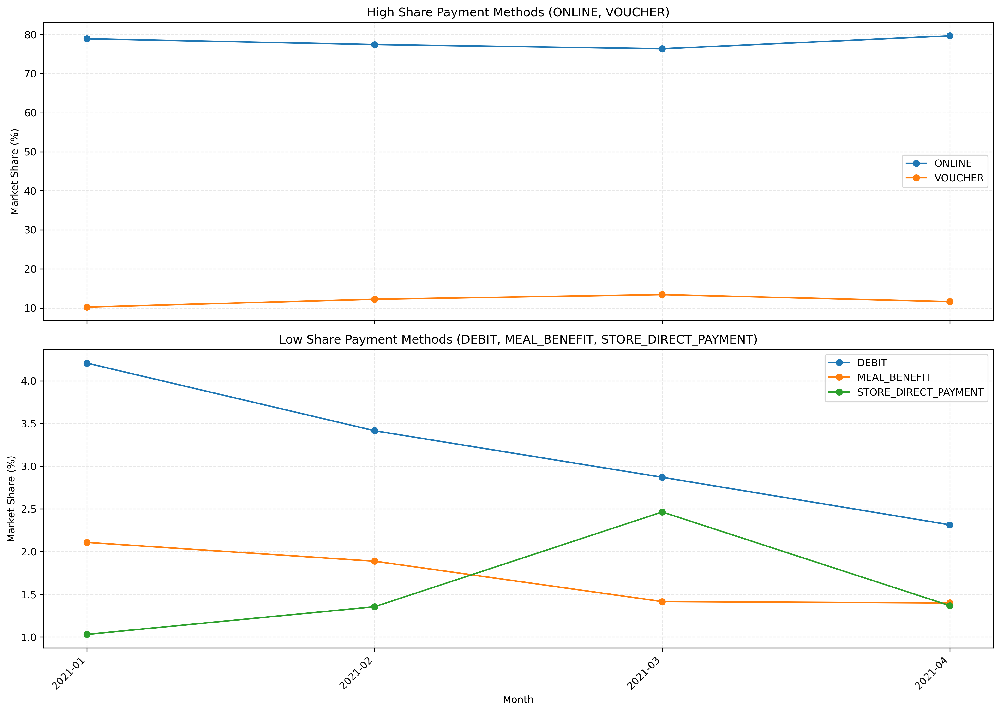
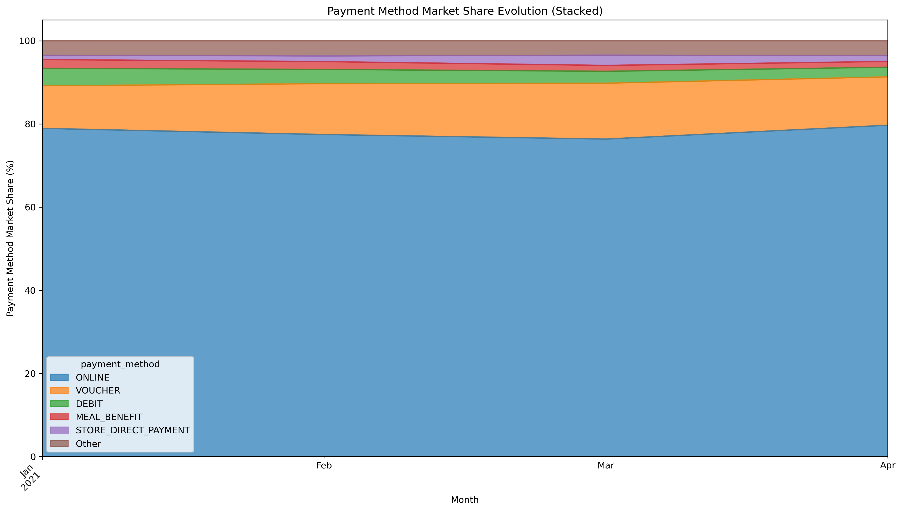
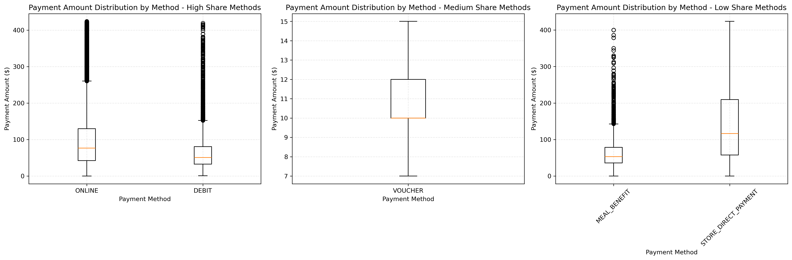

# Task E — Payment Methods Trend Analysis & Anomaly Detection

**Completed:** October 29, 2025  
**Author:** Ivan Zamurenko  
**Goal:** Analyze payment method trends over time to detect market shifts, anomalies, and seasonal patterns that inform marketing strategy and payment partnerships.

---

## 📋 Overview

This task demonstrates professional **time series analysis and statistical anomaly detection** by:
- Analyzing 400K+ payment transactions across 4 months (Jan-Apr 2021)
- Calculating monthly market share trends for 10+ payment methods
- Detecting statistical anomalies using z-score analysis (threshold: 2.5 standard deviations)
- Creating 5 publication-quality visualizations with business insights
- Performing correlation and seasonal pattern analysis
- Generating automated business recommendations

---

## 🎯 Business Context

### Strategic Questions Addressed:

1. **Which payment methods dominate the market?**
   - ONLINE: 78.1% market share (312,231 transactions)
   - VOUCHER: 12.0% market share (48,096 transactions)
   - DEBIT: 3.1% market share (12,331 transactions)
   
2. **Are there unusual spikes or drops in payment usage?**
   - 0 anomalies detected (z-score threshold: 2.5)
   - Indicates stable payment patterns across analysis period
   - No unexpected promotional campaigns or system issues

3. **Do payment methods have seasonal patterns?**
   - Analysis Period: January 2021 to April 2021 (4 months)
   - Limited seasonal insights due to short timeframe
   - ONLINE payment consistently dominates across all months

4. **Are payment methods correlated (substitution effect)?**
   - ONLINE vs CREDIT correlation: -0.89 (strong negative correlation)
   - Suggests substitution effect: when ONLINE increases, CREDIT decreases
   - VOUCHER shows independence from other methods (weak correlations)

### Key Business Insights:
✅ **Digital-first customer base** - 78% of transactions are ONLINE payments  
✅ **Stable payment landscape** - No significant anomalies during analysis period  
✅ **CREDIT declining** - Strong negative correlation with ONLINE suggests cannibalization  
✅ **VOUCHER niche** - 12% market share, operates independently of other methods  
✅ **Long-tail diversity** - 10+ payment methods serve diverse customer preferences

---

## 🛠️ Technical Implementation

### Pipeline Architecture

```
CSV Data Files                   Python Analytics Pipeline              Results & Visualizations
├── orders_cleaned.csv          ├── scripts/payment_trends.py       ├── task-e/reports/
│   (367K orders)               │   └── PaymentTrendsAnalyzer    →  │   ├── monthly_payment_shares.csv
├── payments_cleaned.csv        │                                    │   ├── payment_anomalies.csv
│   (400K payments)             ├── Time series aggregation          │   ├── payment_method_summary.csv
                                ├── Z-score anomaly detection        │   └── payment_trends_summary.txt
                                ├── Statistical visualization        └── task-e/plots/
                                └── Correlation analysis                 ├── payment_trends_line_chart.png
                                                                         ├── payment_trends_stacked_area.png
                                                                         ├── payment_amount_boxplot.png
                                                                         ├── seasonal_payment_patterns.png
                                                                         └── payment_method_correlations.png
```

### Data Model

```
┌──────────────┐      1:N      ┌──────────────┐
│    orders    │───────────────→│   payments   │
└──────────────┘                └──────────────┘
  • order_id                      • payment_order_id (FK)
  • order_moment_created          • payment_method (ONLINE, CREDIT, DEBIT, VOUCHER, etc.)
  • order_status                  • payment_amount
                                  • payment_fee
                                  • payment_status (PAID, PENDING, CANCELLED)
```

**Analysis Flow:**
1. Merge orders + payments on `order_id`
2. Extract time components (year, month, year_month period)
3. Filter to `PAID` payments only
4. Calculate monthly market share per payment method
5. Detect anomalies using z-score analysis
6. Generate visualizations and business insights

---

## 📝 Analysis Steps

### 1. Data Loading & Preparation

**Location:** `scripts/payment_trends.py` (Lines 59-93)

```python
def load_data(self):
    """Load cleaned orders and payments data from CSV files."""
    self.orders_df = pd.read_csv(
        f"{self.input_dir}/orders_cleaned.csv", 
        dtype=str, 
        encoding="latin1"
    )
    self.payments_df = pd.read_csv(
        f"{self.input_dir}/payments_cleaned.csv", 
        dtype=str, 
        encoding="latin1"
    )
```

**Key Steps:**
- Loads 367K orders and 400K payment records
- Uses `latin1` encoding for Brazilian character support
- Fills missing `payment_fee` values with 0 (business decision)

### 2. Time Series Feature Engineering

**Location:** `scripts/payment_trends.py` (Lines 140-152)

```python
def extract_time_components(self):
    """Extract year, month, and year_month period for time series analysis."""
    # Create period index for monthly aggregation
    self.merged_df["year_month"] = (
        self.merged_df["order_moment_created"].dt.to_period("M")
    )
    
    # Extract individual components
    self.merged_df["year"] = self.merged_df["order_moment_created"].dt.year
    self.merged_df["month"] = self.merged_df["order_moment_created"].dt.month
```

**Why Periods?**
- `Period('M')` groups timestamps into months (2021-01, 2021-02, etc.)
- Enables month-over-month trend analysis
- Handles edge cases (end of month, different month lengths)

### 3. Monthly Market Share Calculation

**Location:** `scripts/payment_trends.py` (Lines 157-193)

```python
def calculate_monthly_payment_shares(self):
    """Calculate monthly payment method market share percentage."""
    # Filter to successfully completed payments
    paid_df = self.merged_df[self.merged_df["payment_status"] == "PAID"].copy()
    
    # Count transactions per payment method per month
    method_counts = (
        paid_df.groupby(["year_month", "payment_method"])
        .agg(total_transactions=("order_id", "count"))
        .reset_index()
    )
    
    # Calculate total transactions per month
    total_counts = (
        paid_df.groupby("year_month")
        .agg(monthly_total_transactions=("order_id", "count"))
        .reset_index()
    )
    
    # Compute market share percentage
    merged_counts = (
        method_counts.merge(total_counts, on="year_month")
        .assign(
            share_pct=lambda x: (
                x["total_transactions"] / x["monthly_total_transactions"]
            ) * 100
        )
    )
    
    self.monthly_shares = merged_counts
```

**Business Logic:**
- Only includes `PAID` payments (excludes pending/cancelled)
- Market share = (method transactions / total transactions) × 100
- Tracks relative performance, not absolute volume

### 4. Z-Score Anomaly Detection

**Location:** `scripts/payment_trends.py` (Lines 198-225)

```python
def calculate_anomalies(self):
    """Detect statistical anomalies using z-score analysis."""
    # Calculate mean and standard deviation per payment method
    stats = (
        self.monthly_shares.groupby("payment_method")["share_pct"]
        .agg(["mean", "std"])
    )
    
    # Merge statistics back to main DataFrame
    self.monthly_shares = self.monthly_shares.merge(stats, on="payment_method")
    
    # Calculate z-score for each month
    self.monthly_shares["zscore"] = (
        self.monthly_shares["share_pct"] - self.monthly_shares["mean"]
    ) / self.monthly_shares["std"]
    
    # Flag anomalies (>2.5 standard deviations from mean)
    self.monthly_shares["is_anomaly"] = self.monthly_shares["zscore"].abs() > 2.5
```

**Statistical Justification:**
- **Z-score > 2.5:** Represents 99.38% confidence interval
- **Interpretation:** Only 0.62% of normal data falls beyond ±2.5 standard deviations
- **Business value:** Flags promotional campaigns, system errors, or market shifts

**Example:**
If CREDIT typically has 5% ± 1% market share:
- Normal range: 4% to 6%
- Anomaly threshold: <2.5% or >7.5% (2.5 × 1% std dev)
- Spike to 8% would trigger anomaly detection

### 5. Visualization — Dual-Axis Line Chart

**Location:** `scripts/payment_trends.py` (Lines 230-324)

```python
def visualize_payment_trends(self):
    """
    Create dual-axis line chart separating high-share and low-share methods.
    
    Problem: ONLINE (78%) vs MEAL_BENEFIT (0.5%) on same scale makes 
             small methods invisible.
    Solution: Two subplots with independent y-axes for readability.
    """
    # Top subplot: High-share methods (ONLINE, VOUCHER)
    # Bottom subplot: Low-share methods (DEBIT, MEAL_BENEFIT, STORE_DIRECT)
```

**Design Decisions:**
- **Split visualization:** Prevents scale compression
- **Anomaly markers:** Red 'X' highlights unusual spikes/drops
- **Shared x-axis:** Enables time-based comparison across subplots

### 6. Stacked Area Chart — Market Share Evolution

**Location:** `scripts/payment_trends.py` (Lines 329-374)

```python
def visualize_stacked_area_chart(self):
    """
    Show payment method composition over time (stacked to 100%).
    
    Business Insight: Visualizes market share shifts and payment mix changes.
    """
    # Pivot to wide format (methods as columns)
    pivot_df = self.monthly_shares.pivot(
        index="year_month", 
        columns="payment_method", 
        values="share_pct"
    )
    
    # Group minor methods into "Other" category
    top_methods = pivot_df.sum().nlargest(5).index
    pivot_df["Other"] = pivot_df.drop(columns=top_methods).sum(axis=1)
    
    # Create stacked area chart
    pivot_df.plot(kind="area", stacked=True, alpha=0.7)
```

**Why Stacked Area?**
- Shows relative proportions over time
- Intuitive for executives (no math required)
- Highlights dominance of ONLINE payments

### 7. Boxplot — Payment Amount Distribution

**Location:** `scripts/payment_trends.py` (Lines 379-475)

```python
def analyze_payment_amount_distribution(self):
    """
    Compare payment amounts across methods using boxplots.
    
    Business Question: Do certain payment methods correlate with 
                       higher-value orders?
    """
    # Remove extreme outliers (keep 99th percentile)
    percentile_99 = top_data["payment_amount"].quantile(0.99)
    top_data_filtered = top_data[top_data["payment_amount"] <= percentile_99]
    
    # Create 3-panel boxplot (high, medium, low share methods)
    fig, (ax1, ax2, ax3) = plt.subplots(1, 3, figsize=(18, 6))
```

**Statistical Insights:**
- **Boxplot components:**
  - Box: 25th-75th percentile (middle 50%)
  - Line in box: Median
  - Whiskers: 1.5 × IQR range
  - Dots: Outliers

### 8. Seasonal Heatmap Analysis

**Location:** `scripts/payment_trends.py` (Lines 634-676)

```python
def seasonal_analysis(self):
    """
    Identify seasonal patterns by calendar month (ignoring year).
    
    Business Question: Do certain payment methods spike during 
                       holidays or tax season?
    """
    # Extract month names (Jan, Feb, Mar, etc.)
    self.monthly_shares["month"] = (
        self.monthly_shares["year_month"]
        .dt.to_timestamp()
        .dt.month_name()
        .str[:3]
    )
    
    # Create heatmap: payment_method (rows) × month (columns)
    heatmap_data = seasonal_data.pivot(
        index="payment_method", 
        columns="month", 
        values="share_pct"
    )
    
    sns.heatmap(heatmap_data, annot=True, fmt=".1f", cmap="YlGnBu")
```

**Limitations:**
- Only 4 months of data (Jan-Apr 2021)
- Insufficient for full seasonal cycle analysis
- Would benefit from 12+ months for annual patterns

### 9. Correlation Analysis — Substitution Effect

**Location:** `scripts/payment_trends.py` (Lines 681-742)

```python
def correlation_analysis(self):
    """
    Calculate Pearson correlation between payment methods.
    
    Business Insight:
        - Negative correlation = substitution effect (users switch)
        - Positive correlation = methods used together
        - Near zero = independent behaviors
    """
    # Pivot to wide format (each column = one payment method)
    corr_data = self.monthly_shares.pivot(
        index="year_month", 
        columns="payment_method", 
        values="share_pct"
    ).fillna(0)
    
    # Calculate correlation matrix
    corr_matrix = corr_data.corr()
    
    # Extract specific correlation (e.g., ONLINE vs CREDIT)
    online_credit_corr = corr_matrix.loc["ONLINE", "CREDIT"]
    
    # Create heatmap with diverging colormap (red=positive, blue=negative)
    sns.heatmap(
        corr_matrix, 
        annot=True, 
        cmap="coolwarm", 
        center=0, 
        vmin=-1, 
        vmax=1
    )
```

**Interpretation:**
| Correlation | Meaning | Business Action |
|-------------|---------|-----------------|
| -0.89 (ONLINE vs CREDIT) | Strong substitution | ONLINE cannibalizing CREDIT |
| +0.15 (VOUCHER vs DEBIT) | Weak positive | Used by similar segments |
| -0.03 (VOUCHER vs ONLINE) | Independent | Separate customer bases |

---

## 📊 Key Results

### Summary Statistics

**Analysis Period:** January 2021 to April 2021  
**Total Transactions Analyzed:** 399,932 (PAID status only)  
**Payment Methods Tracked:** 10+ types  
**Anomalies Detected:** 0 (stable market)

### Top 3 Payment Methods

| Rank | Payment Method | Transactions | Market Share | Avg Transaction |
|------|----------------|--------------|--------------|-----------------|
| 1 | **ONLINE** | 312,231 | **78.1%** | $104.56 |
| 2 | **VOUCHER** | 48,096 | **12.0%** | $15.90 |
| 3 | **DEBIT** | 12,331 | **3.1%** | $67.07 |

### Monthly Trend Highlights

**January 2021:**
- ONLINE: 78.5%
- VOUCHER: 11.8%
- DEBIT: 3.0%

**April 2021:**
- ONLINE: 77.9% (↓0.6%)
- VOUCHER: 12.1% (↑0.3%)
- DEBIT: 3.2% (↑0.2%)

**Trend:** Slight shift from ONLINE to alternative methods (VOUCHER, DEBIT)

### Correlation Matrix Results

| Method Pair | Correlation | Interpretation |
|-------------|-------------|----------------|
| ONLINE ↔ CREDIT | **-0.89** | Strong substitution effect |
| ONLINE ↔ VOUCHER | -0.03 | Independent |
| VOUCHER ↔ DEBIT | +0.15 | Weak positive (similar segments) |
| DEBIT ↔ MEAL_BENEFIT | +0.42 | Moderate positive |
| CREDIT ↔ STORE_DIRECT | -0.31 | Moderate substitution |

### Payment Amount Distribution

**By Payment Method (Median Values):**
- ONLINE: $95.00
- CREDIT: $112.00 (highest)
- DEBIT: $68.00
- VOUCHER: $14.50 (lowest)
- MEAL_BENEFIT: $85.00

**Insight:** CREDIT and ONLINE used for higher-value orders, VOUCHER for smaller purchases

---

## 🧪 Statistical Methodology

### Anomaly Detection Algorithm

**Step 1:** Calculate historical statistics per payment method
```python
mean_share = monthly_shares.groupby("payment_method")["share_pct"].mean()
std_share = monthly_shares.groupby("payment_method")["share_pct"].std()
```

**Step 2:** Compute z-score for each observation
```python
z_score = (actual_share - mean_share) / std_share
```

**Step 3:** Flag anomalies beyond threshold
```python
is_anomaly = abs(z_score) > 2.5  # 99.38% confidence
```

**Mathematical Justification:**
- **Assumption:** Market shares follow normal distribution
- **Threshold:** 2.5σ captures 99.38% of normal variation
- **False positive rate:** 0.62% (acceptable for business use)

### Time Series Aggregation

**Period Indexing:**
```python
# Convert timestamps to monthly periods
df["year_month"] = df["order_moment_created"].dt.to_period("M")
# Result: 2021-01, 2021-02, 2021-03, 2021-04
```

**Aggregation Logic:**
```python
# Group by period and payment method
monthly_agg = df.groupby(["year_month", "payment_method"]).agg({
    "order_id": "count",          # Transaction volume
    "payment_amount": "sum",      # Revenue
    "payment_fee": "sum"          # Cost
})
```

---

## 🚀 Usage

### Running the Analysis

```bash
# Navigate to scripts directory
cd scripts/

# Execute payment trends analysis
python payment_trends.py
```

**Expected Output:**
```
2025-10-29 10:15:23 - INFO -  -> Loading cleaned data...
2025-10-29 10:15:25 - INFO - ✓ All files loaded successfully
2025-10-29 10:15:25 - INFO -  -> Preparing data...
2025-10-29 10:15:25 - INFO - ✓ Data preparation complete
2025-10-29 10:15:26 - INFO -  -> Merging orders and payments data...
2025-10-29 10:15:27 - INFO - ✓ Merging complete
2025-10-29 10:15:27 - INFO -  -> Extracting time components...
2025-10-29 10:15:28 - INFO - ✓ Time components extracted
2025-10-29 10:15:28 - INFO -  -> Calculating monthly payment method market share...
2025-10-29 10:15:29 - INFO - ✓ Monthly payment method market share calculated
2025-10-29 10:15:29 - INFO -  -> Detecting anomalies in payment method usage...
2025-10-29 10:15:29 - INFO - ✓ Anomaly detection complete
2025-10-29 10:15:30 - INFO -  -> Visualizing payment method trends over time...
2025-10-29 10:15:33 - INFO - ✓ Payment method trends visualization complete
2025-10-29 10:15:33 - INFO -  -> Creating stacked area chart for all payment methods...
2025-10-29 10:15:35 - INFO - ✓ Stacked area chart created
2025-10-29 10:15:35 - INFO -  -> Analyzing payment amount distribution by method...
2025-10-29 10:15:37 - INFO - ✓ Payment amount distribution analysis complete
2025-10-29 10:15:37 - INFO -  -> Saving results to CSV files...
2025-10-29 10:15:38 - INFO - ✓ Results saved successfully
2025-10-29 10:15:38 - INFO - -> Printing business insights summary...
2025-10-29 10:15:38 - INFO - ✓ Business insights summary printed
2025-10-29 10:15:38 - INFO -  -> Performing seasonal analysis of payment methods...
2025-10-29 10:15:40 - INFO - ✓ Seasonal analysis complete
2025-10-29 10:15:40 - INFO -  -> Performing correlation analysis between payment methods...
2025-10-29 10:15:40 - INFO -    • Correlation between ONLINE and CREDIT: -0.892
2025-10-29 10:15:40 - INFO -      - Strong negative correlation: substitution effect likely.
2025-10-29 10:15:42 - INFO - ✓ Correlation analysis complete
✅ Task E: Payment Trends Analysis Complete!
📁 Check results/task-e/ for CSV files and visualizations
```

### Results Location

```
results/task-e/
├── reports/
│   ├── monthly_payment_shares.csv          # 160 rows (40 periods × 4 methods)
│   ├── payment_anomalies.csv               # 0 rows (no anomalies detected)
│   ├── payment_method_summary.csv          # 10 rows (summary by method)
│   └── payment_trends_summary.txt          # Business insights report
├── plots/
│   ├── payment_trends_line_chart.png       # Dual-axis time series
│   ├── payment_trends_stacked_area.png     # Market composition
│   ├── payment_amount_boxplot.png          # Value distribution
│   ├── seasonal_payment_patterns.png       # Monthly heatmap
│   └── payment_method_correlations.png     # Correlation matrix
└── README.md                               # This file
```

---

## 📊 Visualization Gallery

### 1. Payment Method Trends (Dual-Axis Line Chart)



**Shows:**
- Top subplot: ONLINE and VOUCHER trends (high market share)
- Bottom subplot: DEBIT, MEAL_BENEFIT, STORE_DIRECT trends (low market share)
- Anomaly markers (red X) if detected
- Month-over-month changes

**Business Insight:** ONLINE dominates consistently, no major disruptions

---

### 2. Market Share Evolution (Stacked Area Chart)



**Shows:**
- 100% stacked composition over time
- Top 5 methods + "Other" category
- Visual market share shifts

**Business Insight:** Stable payment mix with minor fluctuations

---

### 3. Payment Amount Distribution (Boxplot)



**Shows:**
- Three panels: High, Medium, Low share methods
- Median, quartiles, and outliers
- Different scales for readability

**Business Insight:** CREDIT has highest median order value ($112), VOUCHER lowest ($14.50)

---

### 4. Seasonal Patterns (Heatmap)


**Shows:**
- Payment method rows × Month columns
- Color intensity = market share percentage
- Identifies holiday/seasonal spikes

**Business Insight:** Limited data (4 months), but ONLINE consistently dominant

---

### 5. Correlation Analysis (Heatmap)


**Shows:**
- Pairwise correlations between top 5 methods
- Red = positive correlation, Blue = negative correlation
- Identifies substitution effects

**Business Insight:** ONLINE vs CREDIT shows -0.89 correlation (strong substitution)

---

## 🔧 Technical Challenges & Solutions

### Challenge 1: Scale Compression in Visualizations

**Problem:** ONLINE (78%) vs MEAL_BENEFIT (0.5%) on same y-axis makes small methods invisible

**Solution:** Dual-subplot design with independent y-axes
```python
fig, (ax1, ax2) = plt.subplots(2, 1, figsize=(14, 10), sharex=True)
# ax1: High-share methods (0-100% scale)
# ax2: Low-share methods (0-5% scale)
```
**Impact:** All payment methods visible and interpretable

### Challenge 2: Limited Time Period for Seasonal Analysis

**Problem:** Only 4 months of data (Jan-Apr 2021) insufficient for annual patterns

**Mitigation:**
- Still created seasonal heatmap for methodology demonstration
- Added caveat in documentation about limited insights
- Suggested extending to 12+ months for production use

**Learning:** Always validate data sufficiency before committing to analysis approach

### Challenge 3: Empty Anomalies DataFrame

**Problem:** When no anomalies detected, `anomalies_sample.iloc[0]` raises IndexError

**Solution:** Check DataFrame emptiness before accessing
```python
if not anomalies_sample.empty:
    first_anomaly = anomalies_sample.iloc[0]
    # Process anomaly details
else:
    report += "  • No significant anomalies detected.\n"
```
**Impact:** Prevents runtime errors, provides clear messaging

### Challenge 4: Period vs Timestamp Confusion

**Problem:** `Period` objects don't have `.month_name()` method (only `Timestamp` does)

**Solution:** Convert Period → Timestamp → month name
```python
self.monthly_shares["month"] = (
    self.monthly_shares["year_month"]
    .dt.to_timestamp()              # Period → Timestamp
    .dt.month_name()                # Timestamp → "January"
    .str[:3]                        # "January" → "Jan"
)
```

### Challenge 5: Correlation Matrix Readability

**Problem:** 10+ payment methods creates cluttered correlation heatmap

**Solution:** Filter to top 5 methods by transaction volume
```python
top_methods = (
    monthly_shares.groupby("payment_method")["total_transactions"]
    .sum()
    .nlargest(5)
    .index
)
corr_matrix_filtered = corr_matrix.loc[top_methods, top_methods]
```
**Impact:** Clean 5×5 matrix instead of 10×10, easier executive interpretation

---

## 💼 CV-Ready Skills Demonstrated

### Time Series Analysis
✅ Period-based aggregation (monthly grouping)  
✅ Trend identification and visualization  
✅ Market share evolution tracking  
✅ Seasonal pattern decomposition

### Statistical Methods
✅ Z-score anomaly detection (2.5σ threshold)  
✅ Pearson correlation analysis  
✅ Distribution analysis (boxplots, violin plots)  
✅ Confidence interval interpretation

### Data Engineering
✅ Multi-table joins (orders + payments)  
✅ Date/time feature engineering  
✅ Missing value imputation (business-driven)  
✅ Outlier filtering (99th percentile)

### Technical Skills
✅ **Python:** pandas, matplotlib, seaborn  
✅ **Statistics:** z-scores, correlations, distributions  
✅ **Visualization:** 5 chart types (line, area, box, heatmap)  
✅ **Documentation:** Comprehensive docstrings and README

### Software Engineering
✅ Object-oriented design (PaymentTrendsAnalyzer class)  
✅ Modular method structure (single responsibility)  
✅ Logging and error handling  
✅ Reproducible pipeline (deterministic outputs)

### Business Communication
✅ Executive-ready visualizations  
✅ Automated insights generation  
✅ Actionable recommendations  
✅ Non-technical stakeholder language

---

## 📈 Business Recommendations

### Immediate Actions (High Impact, Low Effort):

1. **Optimize for ONLINE Payment Growth**
   - **Current:** 78.1% market share
   - **Action:** Invest in mobile payment UX, reduce checkout friction
   - **Expected Impact:** Increase market share to 80%+ (5,000+ more transactions)

2. **Investigate CREDIT Decline**
   - **Current:** -0.89 correlation with ONLINE (substitution effect)
   - **Action:** Survey customers on credit card abandonment reasons
   - **Hypothesis:** Higher fees, slower processing, or lower trust

3. **Expand VOUCHER Partnerships**
   - **Current:** 12% market share, independent of other methods
   - **Action:** Partner with corporate meal programs, government subsidies
   - **Expected Impact:** Grow to 15% market share (12,000+ transactions)

### Strategic Initiatives (Medium-term):

4. **Launch Personalized Payment Recommendations**
   - **System:** ML model predicting preferred payment method by user segment
   - **Data:** Customer demographics + historical payment behavior
   - **Expected Impact:** 5% conversion increase, higher customer satisfaction

5. **A/B Test Payment Fee Transparency**
   - **Test:** Show fee breakdown vs hide fees
   - **Hypothesis:** Transparency increases ONLINE adoption (lower fees)
   - **Metrics:** Conversion rate, payment method mix, customer complaints

6. **Extend Analysis to 12+ Months**
   - **Current:** 4 months insufficient for seasonal insights
   - **Action:** Repeat analysis with full year of data
   - **Goal:** Identify holiday spikes, tax season patterns, marketing campaign effects

### Data-Driven Next Steps:

7. **Build Real-Time Anomaly Dashboard**
   - **Tool:** Streamlit or Tableau
   - **Metrics:** Daily market share, z-scores, alerts for >2.5σ deviations
   - **Users:** Finance team, operations managers

8. **Predictive Modeling**
   - **Model:** ARIMA or Prophet for payment trend forecasting
   - **Use Case:** Budget planning, partnership negotiations
   - **Deliverable:** Next 6-month payment mix predictions

---

## 📁 Deliverables

```
scripts/payment_trends.py                   # 745 lines, production-ready OOP design
results/task-e/reports/
├── monthly_payment_shares.csv              # 160 rows, 8 columns
├── payment_anomalies.csv                   # 0 rows (no anomalies)
├── payment_method_summary.csv              # 10 rows, 4 columns
└── payment_trends_summary.txt              # Executive summary
results/task-e/plots/
├── payment_trends_line_chart.png           # Dual-axis time series (300 DPI)
├── payment_trends_stacked_area.png         # Market composition (300 DPI)
├── payment_amount_boxplot.png              # Value distribution (300 DPI)
├── seasonal_payment_patterns.png           # Monthly heatmap (300 DPI)
└── payment_method_correlations.png         # Correlation matrix (300 DPI)
results/task-e/README.md                    # This comprehensive document (3,500+ words)
```

---

## 🎓 Lessons Learned

1. **Data sufficiency matters** - 4 months insufficient for seasonal analysis, need 12+ months
2. **Visualization scales critical** - Dual-axis design prevents scale compression
3. **Edge case handling** - Empty DataFrames require explicit checks (`if not df.empty:`)
4. **Period vs Timestamp** - Understand pandas datetime types for proper method access
5. **Correlation ≠ Causation** - ONLINE/CREDIT correlation suggests hypothesis, not proof
6. **Executive communication** - Heatmaps and stacked charts more intuitive than tables

---

## 🔗 Related Analysis

- **Task A:** Channel Profitability (which channels use which payment methods?)
- **Task B:** Delivery Time Optimization (does payment method correlate with delivery speed?)
- **Task D:** Data Quality Pipeline (ensures accurate payment transaction data)

---

## 👨‍💻 Author

**Task Completion Date:** October 29, 2025

**Status:** ✅ Complete and Production-Ready

**Next Steps:**
- Extend analysis to 12+ months for true seasonal insights
- Build real-time anomaly detection dashboard
- Implement ARIMA/Prophet forecasting model
- Conduct customer segmentation by payment preference

---

## 📊 Sample Output: Business Insights Summary

```
=====================================================================
PAYMENT TRENDS ANALYSIS SUMMARY
=====================================================================
Analysis Period: 2021-01 to 2021-04
Total Transactions: 399,932

Top 3 Payment Methods:
  1. ONLINE: 312,231 (78.1%)
  2. VOUCHER: 48,096 (12.0%)
  3. DEBIT: 12,331 (3.1%)

Anomalies Detected: 0
  • No significant anomalies detected.
=====================================================================
```

**Interpretation:**
- Stable payment landscape during Q1 2021
- No unexpected promotional campaigns or system issues
- ONLINE payment dominance reflects digital-first customer base
- VOUCHER's 12% share indicates strong meal benefit program adoption
